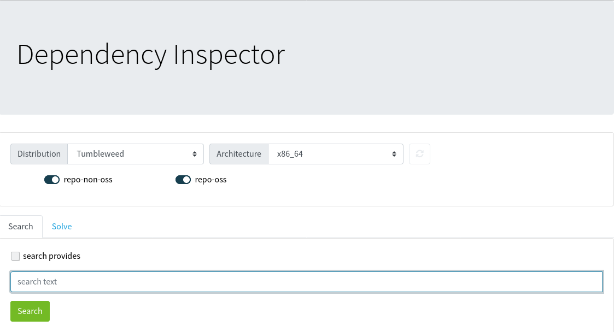
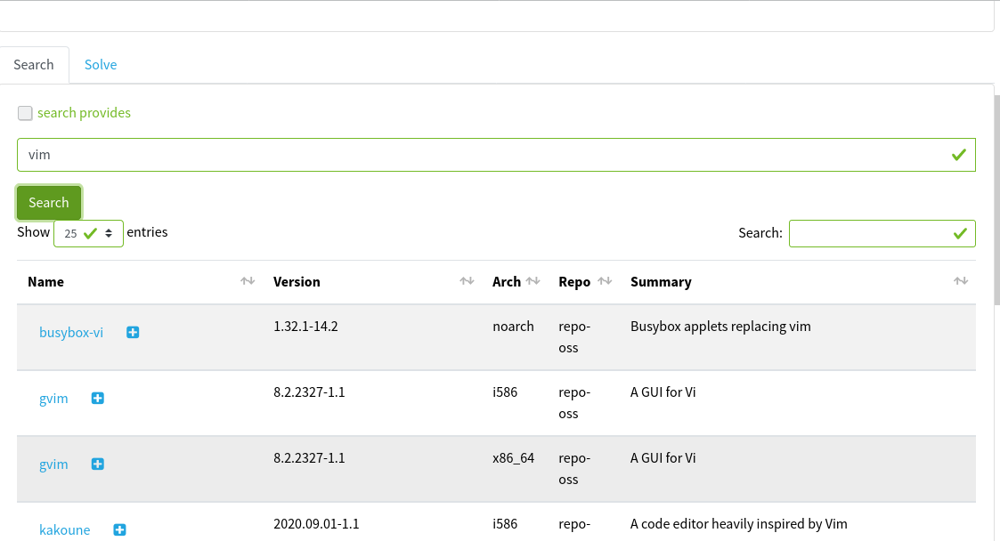
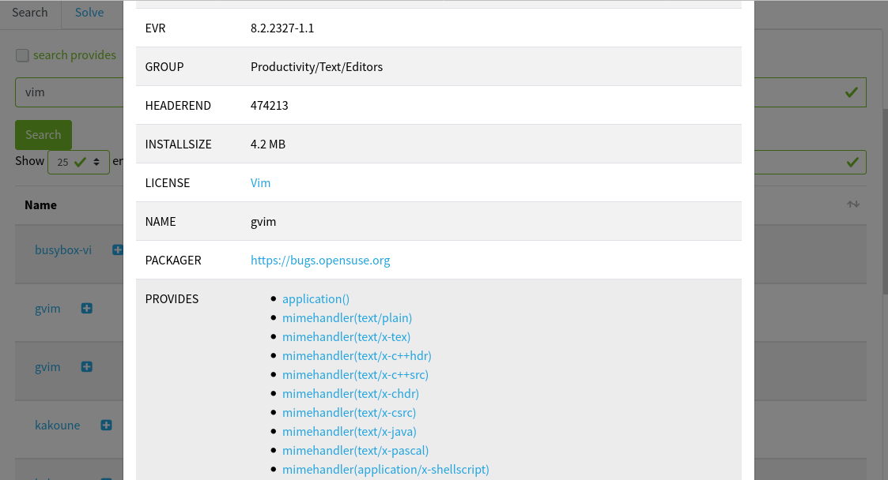
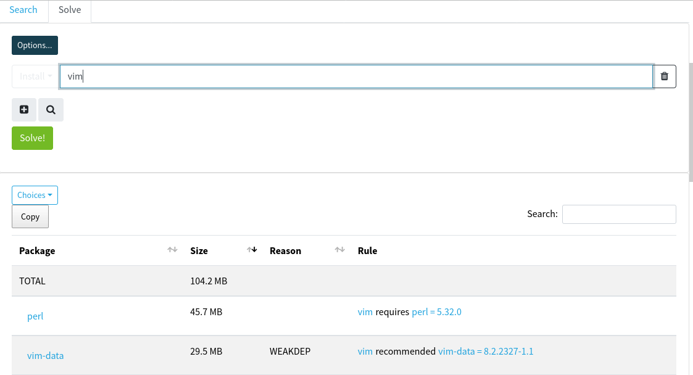

# Lightweight Web Interface For Libsolv

Figuring out why installation sizes suddenly explode or why packages get pulled
into a transaction is a common task in release engineering.
Following dependency chains manually on the command line is tedious though.
So this little program offers an interactive web interface to
simulate package installations.

It leverages Flask and libsolv on server side. The UI is created
using plain Javascript and Bootstrap.

## Screenshots

- Main screen
  
- Searching packages
  
- Inspecting package properties
  
- Solving
  

## Running it

    ./Deptool.py ref -a
    FLASK_ENV=development FLASK_APP=WebSolv.py flask run -h 0.0.0.0
